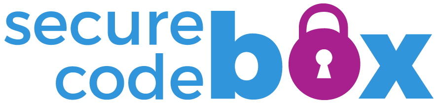
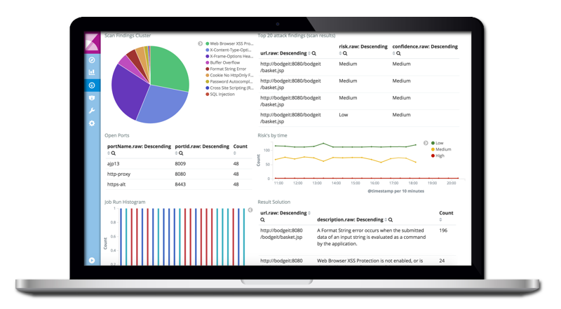
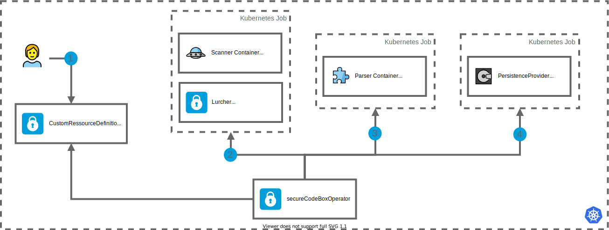

  
  
  
  
  

  
  

> The OWASP secureCodeBox Project is a **kubernetes based, modularized toolchain** for _continuous security scans of your software project_. Its goal is to _orchestrate_ and easily _automate_ a bunch of _security-testing tools_ out of the box. With secureCodeBox we provide a toolchain for continuous scanning of applications to find the low-hanging fruit issues early in the development process and free the resources of the penetration tester to concentrate on the major security issues.

## Description

The purpose of secureCodeBox is not to replace the penetration testers or make them obsolete. We strongly recommend to run extensive tests by experienced penetration testers on all your applications. For more information about this project, please have look at our [GitHub Repo secureCodeBox][scb-github] or [online documentation][scb-documentation].

Our _main goal_ is to implement a major security testing platform and framework which enables developers and teams to integrate a bunch of security testing tools in their CI/CD environment or kubernetes environment as easy as possible. The flexibility and scalability of the platform architecture leads to features like _multi tenancy support_, _large scale (multi-) project testing_, support of distributed and private networks, customizable security test flows, which enables projects to test complex environments without implementing the complete security testing infrastructure on their own.

Secondly we try to foster a broad range of security tools to be easily integrated. Also we will try to integrate existing OWASP Projects as building blocks in our platform.

### Architecture

The secureCodeBox architecture is based on Kubernetes Custom Ressource Definitions (CRDs) and follows a function as a service (FaaS) principle. Therefore we implemented a Kubernetes operator which schedules _security scans_ as _kubernetes jobs_. This architecture is much more resource efficient. Instead of long running microservices (SCB v1 Architecture), scans only consume cluster resources for a short amount of time.  

## Roadmap

As of **Feb, 2021, the highest priorities for the next 12 months** are:

- Finalize a new kubernetes *autodiscovery* service which is capable of generating new secureCodeBox Scans based on existing or newly spawned kubernetes resources.
- Finalize the deep integration with the OWASP DefectDojo Project, as a building block for security finding analytics
- Implement a  secureCodeBox UI to visualize the security scan findings as an alternative to OWASP DefectDojo and Kibana (ELK Stack)
- Integrate new Cloud specific security scanners for AWS, GCP, Azure, DigitalOcean

## Quickstart secureCodeBox

For a quickstart see our [installation documentation][scb-installation-doc] and the [starting your first scan documentation][scb-starting-scan-doc] on our comprehensive [documentation site][scb-documentation].

## Community

You are welcome, please join us on... 👋

- [GitHub][scb-github]
- [Slack][scb-slack]
- [Twitter][scb-twitter]

### Contributors

## Licensing

This Project is free software: you can redistribute it and/or modify it under the terms of the [Apache License 2.0](https://github.com/secureCodeBox/secureCodeBox/blob/master/LICENSE). OWASP secureCodeBox Project and any contributions are Copyright by the secureCodeBox authors.

[scb-website]: https://www.securecodebox.io/
[scb-documentation]: https://docs.securecodebox.io/
[scb-installation-doc]: https://docs.securecodebox.io/docs/getting-started/installation
[scb-starting-scan-doc]: https://docs.securecodebox.io/docs/getting-started/first-scans
[scb-website-integrations]: https://docs.securecodebox.io/docs/scanners
[scb-github]: https://github.com/secureCodeBox/secureCodeBox
[scb-twitter]: https://twitter.com/secureCodeBox
[scb-slack]: https://join.slack.com/t/securecodebox/shared_invite/enQtNDU3MTUyOTM0NTMwLTBjOWRjNjVkNGEyMjQ0ZGMyNDdlYTQxYWQ4MzNiNGY3MDMxNThkZjJmMzY2NDRhMTk3ZWM3OWFkYmY1YzUxNTU
[scb-license]: https://github.com/secureCodeBox/secureCodeBox/blob/master/LICENSE

